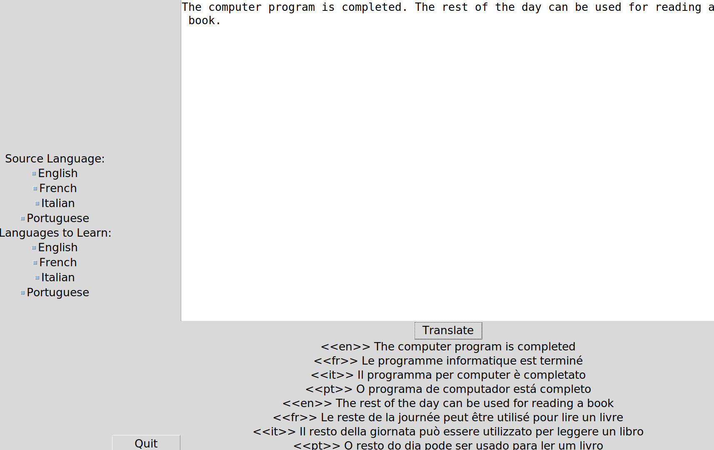

# language-learn
Learn new languages by seeing the side-by-side translations.



Virtualenv setup:

```shell
sudo pip install virtualenv
virtualenv venv --python=python3
source venv/bin/activate
pip install -r requirements.txt
```

Set up Google Cloud (source https://raw.githubusercontent.com/googleapis/python-translate/master/README.rst):

>In order to use this library, you first need to go through the following steps:
>
>1. [Select or create a Cloud Platform project.](https://console.cloud.google.com/project)
>2. [Enable billing for your project.](https://cloud.google.com/billing/docs/how-to/modify-project#enable_billing_for_a_project)
>3. [Enable the Google Cloud Translate API.](https://cloud.google.com/translate)
>4. [Setup Authentication.](https://googleapis.dev/python/google-api-core/latest/auth.html)

Store credentials in `account_key` directory.

When running code, setup the environment variables:

```shell
export LANGUAGE_LEARN_GOOGLE_PROJECT=projects/project-123
export GOOGLE_APPLICATION_CREDENTIALS=./account_key/project-123.json
python main.py
```

You can put it into a shell script to make it simpler to launch the program. There is an example: [main.sh.example](./main.sh.example). Copy it to `main.sh` and update the environment variables to match what you need.
